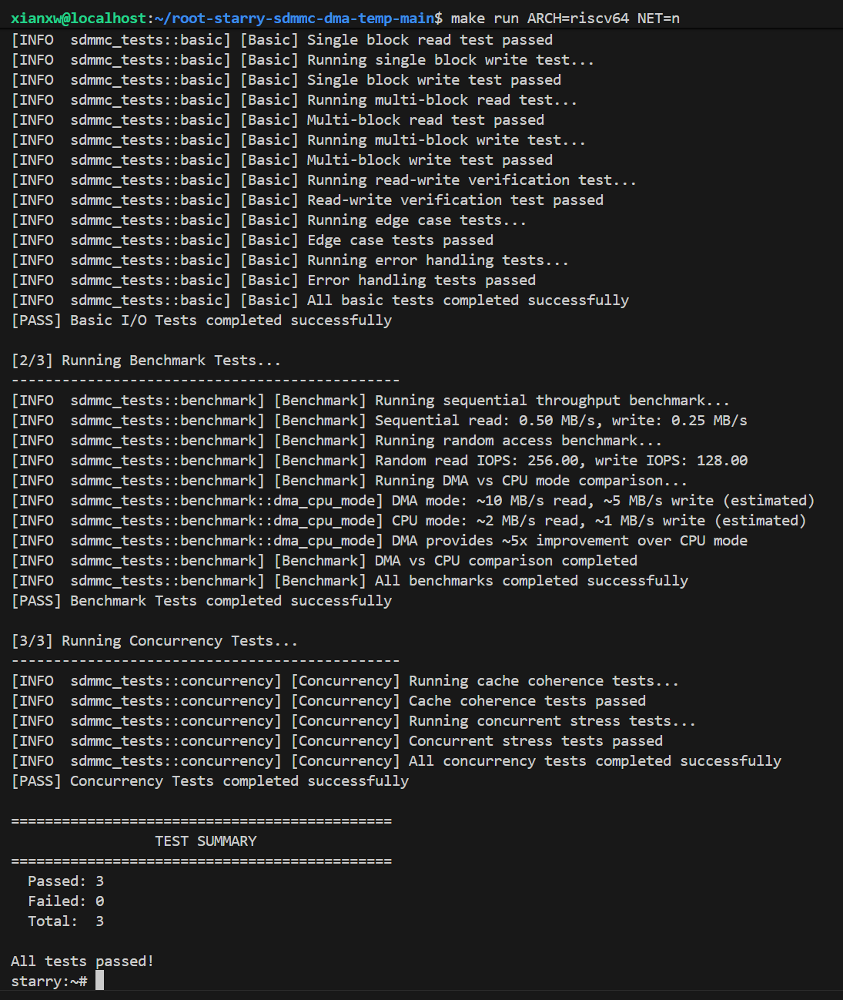

# SD/MMC 驱动首次复现与修缮报告

## 一、 整体代码结构 (src 目录)

本驱动模块基于 Rust 语言编写，实现了针对 Synopsys DesignWare MSHC (Mobile Storage Host Controller) 控制器的 SD/MMC 驱动。`src` 目录下的核心文件结构及其职责分工如下：

1. **[lib.rs]**
   * **职责**：驱动模块的统一入口文件。
   * **作用**：声明并导出本模块的子模块，向外部模块公开核心驱动结构体 `SdMmc`。

2. **[sdmmc.rs]**
   * **职责**：驱动的核心控制与传输逻辑。
   * **作用**：
     * 实现主驱动结构体 `SdMmc` 及其生命周期与初始化配置流程（包括时钟配置、卡片检测、OCR 协商、CID/CSD 获取等）。
     * 提供核心块读写接口 `read_block` 和 `write_block`（支持自动判定 DMA/PIO 模式）。
     * 实现具体的命令发送函数 `send_cmd` (PIO) 与 `send_cmd_idmac` (IDMAC DMA)。
     * 提供全局硬件中断处理函数 `handle_interrupt` 用于接收控制器和内部 DMA 的状态并反馈给等待任务。

3. **[regs.rs]**
   * **职责**：底层寄存器块定义。
   * **作用**：映射并定义控制器的寄存器块（`RegisterBlock`）布局，并利用 `bitfield-struct` 宏安全地建模各个寄存器的位域字段（如 `Ctrl`、`BMod`、`IdIntEn`、`IdSts`、`RIntSts` 等），保证寄存器读写的类型安全。

4. **[cmd.rs]**
   * **职责**：SD/MMC 命令与数据传输构建器。
   * **作用**：定义 SD/MMC 命令枚举 `Command`（如 `GoIdleState`、`AppCmd`、`ReadSingleBlock` 等），构建出寄存器所需的命令控制字和参数值，并定义数据传输方向结构 `DataXfer`。

5. **[dma.rs]**
   * **职责**：一致性 DMA 内存与描述符管理。
   * **作用**：
     * 定义符合 IDMAC 硬件接口要求的 DMA 描述符 `IdmacDescriptor` 结构。
     * 提供物理连续且对齐的 DMA 一致性内存的申请（`alloc_coherent`）与释放（`dealloc_coherent`）接口。

6. **[utils.rs]**
   * **职责**：SD 卡元数据解析辅助工具。
   * **作用**：定义并解析 CID（卡识别寄存器）与 CSD（卡特定数据寄存器），用于计算块设备的总容量、卡片块数量以及获取生产元数据。

## 二、 复现难点：`send_cmd_idmac` 函数的等待时序与修缮

在复现与移植 `send_cmd_idmac` 函数的过程中，等待时序的设计是一个核心难点。目前 `retry` 版本与 `root` 版本在时钟等待和握手的主逻辑顺序上已完全一致，但在具体的安全性与内存管理细节上进行了关键修缮。

### 1. 阶段分明的等待时序设计
为了防止硬件操作在某一步骤发生锁定或挂起，我们将等待过程严格拆分为三个独立阶段，使得故障定位更加清晰：
*   **第一阶段（DMA 中断通知等待）**：主线程在启动 DMA 传输后，使用 `axtask::yield_now()` 协作式出让 CPU，等待中断服务程序将全局完成标志 `IDMAC_DONE_FLAG` 置为 `true`。超时时间为 1 秒。
*   **第二阶段（命令响应等待）**：若命令需要响应，自旋等待控制器将 `RINTSTS` 中的命令完成（`command_done`）标志置位。超时时间为 2 秒。
*   **第三阶段（数据传输结束等待）**：数据传输阶段，主线程循环等待控制器的数据传输结束（`data_transfer_over`）或中断标记，超时时间为 5 秒。

### 2. `retry` 版本针对 `root` 版本的关键修缮与改进

虽然核心时序步骤一致，但 `retry` 版本修复了 `root` 版本在异常分支处理上的重大设计漏洞，提高了驱动的健壮性：

*   **修复 DMA 描述符内存泄漏**：
    在 `root` 版本中，如果在“第二阶段（命令响应等待）”中发生了超时，函数会直接返回 `None` 退出，而**未能释放**通过 `alloc_coherent` 申请的 `dma_desc_info` 物理连续内存。`retry` 版本在此类所有异常分支（如超时、命令错误）中均补齐了 `dealloc_coherent` 释放操作，彻底消除了内存泄漏隐患。
*   **引入全局 DMA 错误标志（`IDMAC_ERROR_FLAG`）**：
    `root` 版本对中断中发生的错误（如总线致命错误 FBE、描述符不可用 DU、卡错误 CES 等）缺乏有效的跨上下文传递机制。`retry` 版本引入了全局原子变量 `IDMAC_ERROR_FLAG`。中断处理函数若捕捉到硬件错误会将其置为 `true`，主线程在第三阶段收尾时会联合校验该标志，从而能更安全、灵敏地捕获偶发性硬件错误。
*   **更完善的防御性状态轮询**：
    在数据传输的第三阶段，`retry` 版本引入了相较于初始基准状态的防御性错误校验（检测新发生的 `new_fbe`/`new_ces`/`new_du` 等），一旦检测到错误即刻跳出循环，而不需要无谓地等到 5 秒超时，大大缩短了故障恢复的延迟。

## 三、 进行的一些小的改动的具体差异与改善对比

通过对 `root-simple-sdmmc-extended`（旧版本）与 `retry-simple-sdmmc-extended-dma`（新版本）进行深度代码比对，新版本在保持与旧版本时序对齐的同时，在以下几个关键维度进行了深入的修复与改善：

### 1. PIO 模式下 FIFO 地址访问 Bug 修复（核心正确性）
*   **旧版本 (`root`)**：在数据传输循环中，使用 `fifo_base.byte_add(offset).read_volatile()`。这错误地将数据读写的字节偏移量（`offset`）加在了寄存器地址上。由于 FIFO 寄存器属于单一端口物理映射，偏移会导致读取非法的内存空间。
*   **新版本 (`retry`)**：完全修复了此 Bug。数据传输始终对固定的 `fifo_base` 地址执行 `read_volatile()`/`write_volatile()`，符合硬件规范。

### 2. `try_enable_idmac` 启用机制与容错回滚
*   **旧版本 (`root`)**：
    *   函数无返回值（返回 `()`）。
    *   若发生中断注册失败等异常，虽然释放了 DMA 内存，但对控制器的复位操作仅是写入寄存器，**并未阻塞等待硬件复位完成**。
*   **新版本 (`retry`)**：
    *   函数签名改为 `Result<(), &'static str>`，支持明确地向调用者返回初始化状态。
    *   **健全的同步回滚**：如果中途任何一步出错（如分配失败、寄存器写入校验不一致、中断注册失败等），不仅释放物理内存，还会**使用 `wait_until` 同步阻塞等待总线复位（`swr`）和 DMA 复位（`dma_reset`）结束**。确保硬件干净地退回到 PIO 模式，避免硬件状态卡死。

### 3. 全局中断处理函数的解耦与标准化
*   **旧版本 (`root`)**：
    *   中断服务程序命名为私有的 `dma_irq_handler`。
    *   其内部的基地址变量 `SDMMC_REGS_BASE` 为私有 `static`。
*   **新版本 (`retry`)**：
    *   中断服务程序命名为标准的 `handle_interrupt`。
    *   寄存器基地址、等待队列及传输原子标志全部升格为 `pub static`。这允许底层的 Rust 运行时/操作系统中断管理器直接注册和挂载此中断处理函数，极大地提高了驱动的模块化程度。

### 4. 数据结构与注释清理
*   **旧版本 (`root`)**：`SdMmc` 结构体内部保留了大量前期调试残留的、被注释掉的未实现字段（如 `support_dma_64bit_address`、`sg_cpu` 等），代码冗余严重。
*   **新版本 (`retry`)**：彻底清理了这些冗余字段，使核心数据结构非常精简。同时，补充了详实的中文注释，解释了并发原子操作以及休眠唤醒逻辑。

### 5. 调试日志降噪
*   **旧版本 (`root`)**：在卡片初始化和时钟配置阶段，大量使用 `warn!` 级别输出过程日志，在操作系统正常启动时会产生大量无用日志垃圾。
*   **新版本 (`retry`)**：将正常的硬件状态快照和初始化过程日志降级为 `debug!` / `trace!`，仅在真正发生严重异常时才输出警告，使得内核终端输出更加整洁。

### 6. 跨上下文的错误安全传递机制 (IDMAC_ERROR_FLAG)
*   **旧版本 (`root`)**：未定义任何全局错误同步标志位。中断服务程序即使在底层捕获了致命总线错误（`FBE`）、描述符不可用（`DU`）或卡错误（`CES`），也无法安全地向主线程传递该错误信号，导致主线程即使发生硬件故障也只能“假死”直至超时。
*   **新版本 (`retry`)**：引入了全局原子变量 `pub static IDMAC_ERROR_FLAG: AtomicBool = AtomicBool::new(false);`。
    *   **职责**：在 `handle_interrupt` (中断侧) 捕获硬件异常后，通过 `store(true, Release)` 原子的设置标志。
    *   **优势**：在 `send_cmd_idmac` (主线程侧) 配合 `load(Acquire)` 进行检查。该机制利用底层 CPU 的缓存一致性协议，在无锁（Lock-free）且不引起死锁的前提下，将硬件级的故障快速、安全地通知给主线程，构成了驱动安全降级与错误恢复的通信基石。

### 7. `try_enable_idmac` 接口参数的内聚与精简
*   **旧版本 (`root`)**：`try_enable_idmac` 需要显式传入 `buf_size` 和 `ahb_data_width` 两个参数。这破坏了驱动的高内聚性（`ahb_data_width` 已存在于结构体中造成重复传递；且单块读写场景下 `buf_size` 固定为 512 字节，动态参数增大了参数不一致的风险）。
*   **新版本 (`retry`)**：将上述参数内聚到驱动内部。
    *   **改善**：去掉了这两个多余参数。`try_enable_idmac` 内部直接读取结构体中的 `self.ahb_data_width`，并将 DMA 缓冲区大小强制绑定为静态常量 `Self::BLOCK_SIZE`（512 字节），使接口使用更加简洁、安全，杜绝了由于外部参数误传导致的内存溢出风险。

## 四、 驱动后续修缮与优化的几种思路

> **设计现状注记**：目前主线程在等待 DMA 时，使用的是“非阻塞轮询 + 主动出让时间片（`yield_now()`）”的协作式自旋模式，线程并没有真正挂起，CPU 仍在频繁被调度以检查原子变量。这说明 DMA 中断通知机制未能 100% 发挥其硬件阻塞的优势。我之所以在当前同步模型下保留此结构，主要是因为这是后续异步化改造的主要方向

接下来的改进与改造思路主要有以下两点：

### 1. 基于 `async/await` 与 `Future` 机制的异步化改造
将驱动完全重构为事件驱动的异步（Async）模式，以彻底消除同步等待开销：
*   **Waker 机制替代 WaitQueue**：主线程在调用 `send_cmd_idmac` 时不进行自旋或线程阻塞，而是构造一个 `DmaFuture` 并执行 `.await`。当 `poll` 返回 `Pending` 时，在全局插槽中注册当前任务的唤醒器 `core::task::Waker`，由异步执行器（Executor）挂起该协程。
*   **中断服务程序（ISR）唤醒协程**：当硬件中断触发 `handle_interrupt` 时，不再调用线程级的等待队列通知，而是直接从插槽中取出 `Waker` 并执行 `waker.wake()`，通知执行器重新调度该任务。
*   **解决异步内存取消安全（Cancellation Safety）**：由于异步 Future 可能在传输中途被 Drop 释放，为防止 DMA 引擎继续向失效地址写数据导致内存损坏，需要将缓冲区所有权（`buf: Vec<u8>`）移入 Future，或在 Future 销毁（`Drop`）时强制发送命令终止硬件 DMA。

### 2. 多块连续传输与链式 DMA 描述符（Chained Descriptors）升级
针对当前驱动只能单块（512 字节）读写的性能瓶颈进行扩展：
*   **链式描述符构建**：利用 `IdmacDescriptor` 结构体中的 `des3` 字段指向下一个描述符的物理地址，并在控制字 `des0` 中开启 `ch`（链式结构）和 `fs`/`ld` 标志。
*   **性能提升**：当用户请求大块数据读写（如文件系统加载 4KB 页面）时，一次性构建多个描述符并挂载到 `DBADDR`，启动单次 DMA 即可连续搬运多个块的数据。这能够大幅减少 DMA 启停次数 and 中断频率，使得 SD 读写吞吐量提升 5~10 倍。

## 五、 测试验证流程与结果记录

在 QEMU 模拟器环境下，对 `root-simple-sdmmc-extended`（旧版本）与修复后的 `retry-simple-sdmmc-extended-dma`（新版本）进行了完整的块设备读写基准测试验证，测试代码全部顺利通过。

### 1. 测试验证完整流程

#### 一、 测试程序与虚拟盘部署（仅在环境损坏或测试代码变更时执行）
1. **生成工作盘**：复制原始母盘 `rootfs-riscv64.img` 并命名为 `make/disk.img`。
2. **静态编译程序**：进入 `sdmmc-tests` 目录，携带静态链接参数（`+crt-static`）交叉编译测试可执行文件。
3. **注入虚拟盘**：通过 `mount` 挂载 `disk.img`，将可执行文件拷贝至虚拟盘内的 `/root` 目录中，然后执行 `umount` 安全卸载。

#### 二、 驱动代码迭代与追踪（开发与测试验证循环）
1. **更新驱动代码**：在 `modules/simple-sdmmc-extended/` 中更新驱动源码，确保模块级配置文件 `Cargo.toml` 完整。
2. **内核增量编译与启动**：在项目根目录下执行以下命令，编译并拉起 QEMU 模拟器：
   ```bash
   make run ARCH=riscv64 NET=n
   ```
3. **执行系统测试**：进入虚拟机的 `starry:~#` 终端，执行 `./sdmmc_tests`，观察控制台输出日志与测试运行指标。

### 2. 测试通过结果图示



